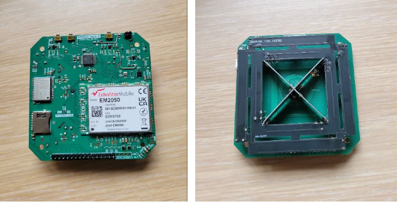
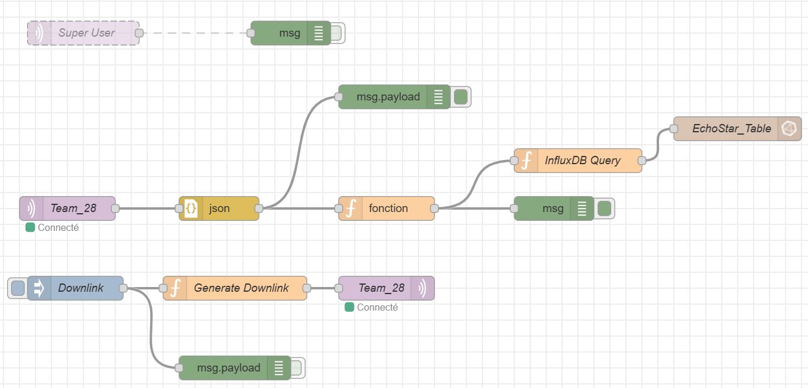

# LEAT_RainGauge_Relay_EchoStar Project

This repository contains the source code and documentation for the **LEAT_RainGauge_Relay_EchoStar** project.

## Project Overview

The project aims to create a raingauge network that can operate independently of terrestrial LoRaWAN networks. To achieve this, the RainGauge will send its data to a terminal that contains an EchoStar and a relay receiver.

## Components

### RainGauge

RainGauge is a compact, low-power LoRaWAN-based rain sensor. This sensor is also integrated with temperature and humidity sensors (SHTC3 from Sensirion).

Details of the RainGauge can be found here: [github.com/FabienFerrero/RainGauge](https://github.com/FabienFerrero/RainGauge).

 
  

### First Verison

The First version uses two different boards, one for relay and the other one for the Module EchoStar

### Relay Receiver

The relay receiver is an UCA_AIoT Board.

Details of the UCA_AIoT Board can be found here: [github.com/FabienFerrero/UCA_AIOT](https://github.com/FabienFerrero/UCA_AIOT).

 
  

### EchoStar

EchoStar is a LoRaWAN terminal that uses the EM2050 LoRaWAN module, developed by the **CMA Team** at **Laboratoire d'Electronique, Antennes et Télécommunications (LEAT), Université Côte d'Azur**. It utilizes EchoStar Mobile for satellite and terrestrial communication.

Details of the EchoStar terminal can be found here: [github.com/nguyenmanhthao996tn/LEAT-EchoStar-Terminal-BSP](https://github.com/nguyenmanhthao996tn/LEAT-EchoStar-Terminal-BSP).

 
  

### Second Verison

The second version uses a single board divided into two sections: one dedicated to the RAK3172 for the relay, and the other to the EchoStar module.

### Relay_EchoStar

This board receives data from the relay and then forwards the received data to the satellite

Details can be found here: [github.com/nguyenmanhthao996tn/ApolloEcho_Dev_Kit_PCB](https://github.com/nguyenmanhthao996tn/ApolloEcho_Dev_Kit_PCB).

 

## Node-RED

Node-RED is an open-source development tool used to receive data sent from the RainGauge to the satellite via MQTT, with the aim of storing it in the database

 

## Contributors

- **Author:** Galci Jostin Basso-Bibila
- **Supervisor:** Fabien Ferrero

---
